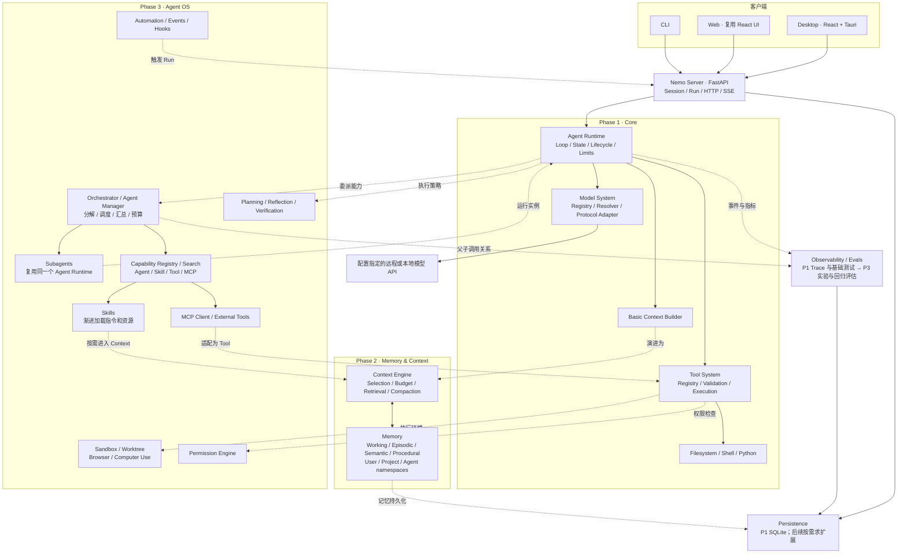
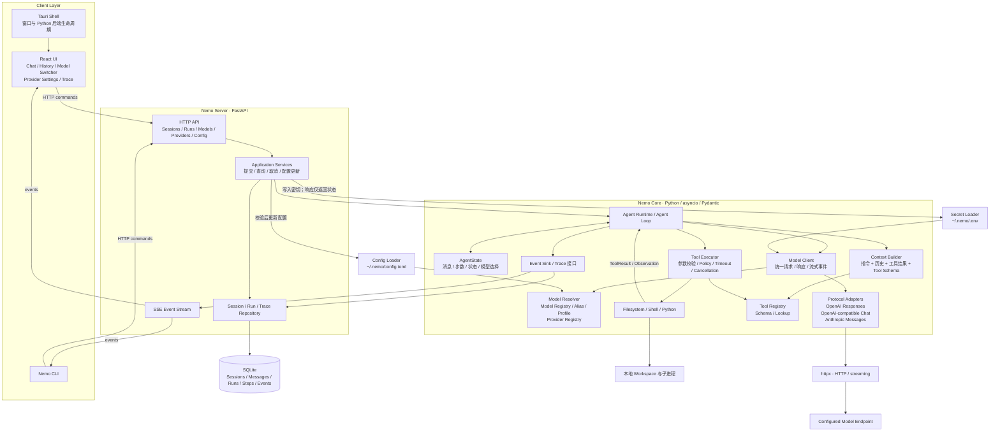
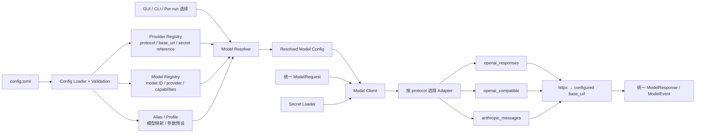
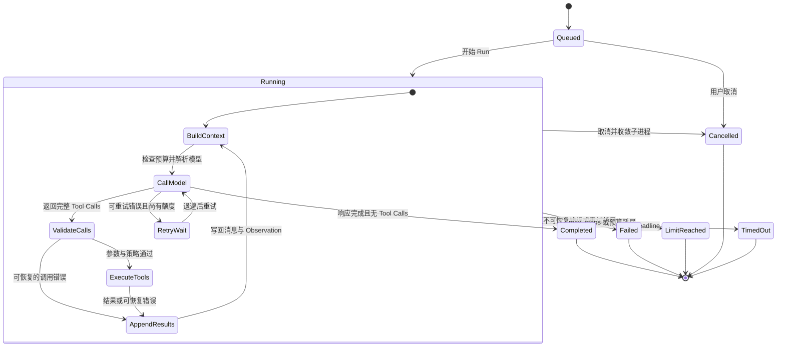
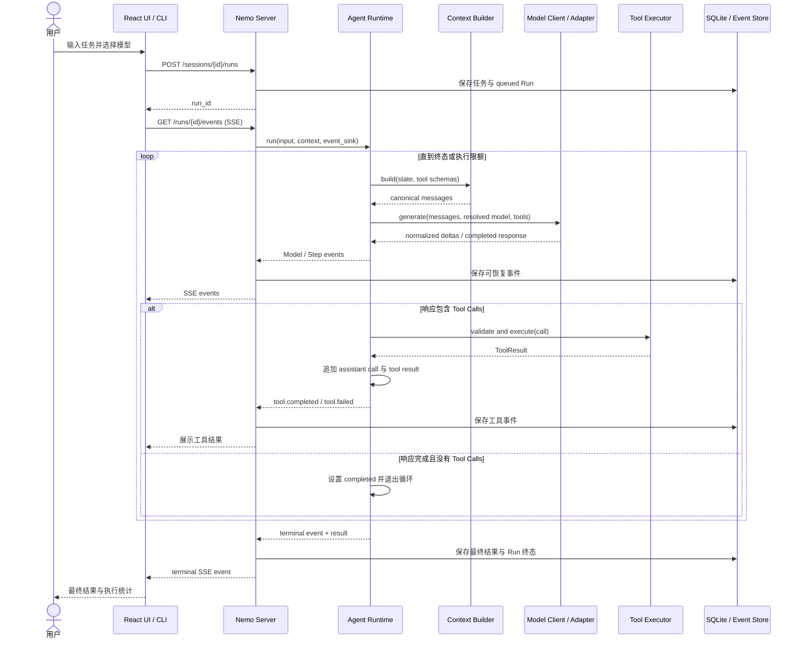
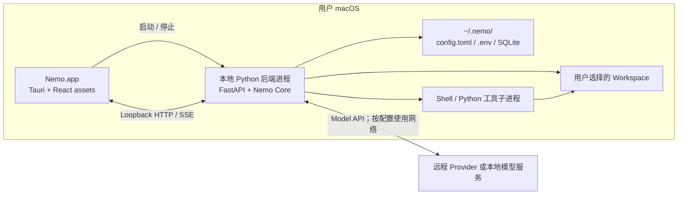

# Nemo 架构设计

> 状态：设计基线；M1 最小内核已实现，其余模块仍为规划。整理日期：2026-09-16。
> 依据：[Nemo 架构讨论记录](https://chatgpt.com/share/6aaa6257-d5c4-83ea-9f92-73032288b16b)。
> 本文按讨论最后形成的方案整理；标注“工程建议”的内容是为明确实现边界而补充，尚非聊天中已确认的决定。

## 1. 定位与已确定的边界

**Nemo = 可日常使用的个人 Agent + 从底层实现的 Agent 技术实验平台。**

核心执行链为：Client → Server → Agent Runtime → Model / Tool → Observation → Model → Result。

- 自行实现 Agent Loop、Tool 调度、Context，以及后续 Memory、Subagent、Skills 等机制。
- 基础设施采用 Python 3.12+、asyncio、httpx、Pydantic、FastAPI、SQLite。
- UI 使用 React + TypeScript + Vite，Tauri 提供桌面外壳，优先 macOS。
- Core 完全不知道 GUI 存在；CLI、Desktop、Web 均为客户端。
- 模型接入遵循 **Providers are configuration, protocols are code**。
- 用户配置使用 TOML（`~/.nemo/config.toml`），依赖标准库 `tomllib`，不引入 YAML 依赖；密钥仍由 `~/.nemo/.env` 提供（权限 600）。此项在 M2 实施时由 YAML 调整为 TOML，理由是不增加第三方依赖并避免 YAML 隐式类型转换。
- 先做可运行、可观察的单 Agent，再加入 Memory / Context，最后发展 Multi-Agent 与 Agent OS 能力。
- Tracing 从 Phase 1 开始；评估能力随阶段扩展。

讨论中的两项旧方案已经被后续方案替代：Phase 1 不再仅有 CLI，也包含桌面 UI；模型层不再采用“一家 Provider 一个 Python 文件”。

## 2. 总体演进架构

下图是目标逻辑架构，不是 Phase 1 的交付清单，也不代表每个模块都需要独立进程。实线为主要调用/数据流，虚线为后续能力接入或观测关系。



Memory 保存可跨任务复用的信息；Context 决定某次模型调用实际能看到什么。二者不等同。Subagent 复用 Runtime，但拥有独立的状态、上下文、工具集合及预算。

## 3. Phase 1 详细架构



图中的 Event Sink 与 Repository 是接口边界；Core 只产生领域事件，不调用 FastAPI/SSE，不依赖 SQLite 的具体实现。外层装配持久化与流式订阅。

**工程建议：Phase 1 CLI 默认走 Server，与 UI 共用 Session/Run 生命周期；测试和嵌入式使用可直接调用稳定 Core API。** 这样避免两套任务状态实现。

## 4. 模块职责与依赖约束

| 模块 | 负责 | 边界 |
| --- | --- | --- |
| Desktop Shell | macOS 窗口、启动/停止后端、应用打包 | 不承载 Agent 决策 |
| React UI / CLI | 用户输入、模型选择、展示执行过程 | 不直接读数据库或调用模型厂商 |
| Server | API、Session/Run 服务、事件订阅、配置管理 | 不实现第二套 Agent Loop |
| Runtime | 多步执行、状态转换、终止条件、取消 | 不引用 GUI，不判断 Provider 品牌 |
| Context Builder | 将基础历史、指令、结果、工具定义组装为统一消息 | Phase 1 不做长期记忆与高级压缩 |
| Model System | 模型解析、协议转换、流式解析、规范化错误 | 协议差异封装在 Adapter 中 |
| Tool System | Schema、参数验证、执行、结果与错误封装、执行上下文与 Policy | 模型只能提出调用，由 Runtime 执行；工具不得自行读取全局状态 |
| Persistence | 会话、运行及 Trace 的保存与读取 | 不存密钥，不冒充长期 Memory |
| Observability | 记录模型/工具调用、耗时、token、错误 | 不要求暴露模型内部推理 |

依赖方向：Client → Server → Core contracts；存储、HTTP、进程执行等适配器在外层装配。模块不等于微服务，Phase 1 可以在一个 Python 后端进程内运行。

## 5. Model / Provider 架构



- **Provider**：连接哪个服务，配置地址、协议和密钥引用。
- **Protocol**：请求、流式片段、Tool Calling、错误如何编码/解码，需要代码实现。
- **Model**：某个 Provider 下的模型标识与能力声明。
- **Alias**：可读名称到模型的映射。
- **Profile**：模型选择与推理参数的组合预设。
- **Model Client**：向 Runtime 提供统一调用接口。

新增使用现有协议的 Provider 只改配置；出现新协议才增加 Adapter。所谓 compatible 不保证所有能力完全一致，工具调用与流式行为需通过协议合同测试确认。

工程建议：模型解析优先级为 `per-run override > session selection > agent/profile > global default`；配置加载时检查引用存在、协议受支持、所需能力可用。

工程建议：运行中切换模型先保存为 pending selection，在本轮模型响应及其所有工具结果完成后、下一次模型请求前应用；不截断正在生成的 Tool Call。每次模型调用记录实际模型与配置版本。跨协议无法转换的历史内容返回明确错误，不静默丢弃。配置错误或模型能力不匹配时保留原选择并反馈原因。

## 6. Agent Loop 状态机

以下为工程建议，用于明确 Phase 1 的执行和失败边界。一次 step 定义为一次模型调用及其产生的全部工具调用；重试另记 attempt。



关键规则：

1. 模型流式返回的参数片段必须组装完成并校验后才能执行工具。
2. 含 Tool Calls 的响应先追加完整 assistant 消息，再追加与各 `tool_call_id` 对应的结果。
3. Phase 1 建议按响应中的顺序串行执行工具，确保文件与 Shell 操作的顺序可预测。
4. 工具异常返回结构化 `ToolResult`，允许模型修正；不伪造成功。
5. 传输重试与工具重试分开。有副作用的工具不能自动重放；模型响应已部分输出时不直接拼接重试结果。
6. 正常结束、取消、超时、失败和预算耗尽是不同终态；每个 Run 只提交一次终态。
7. cancellation 需要传播到 HTTP 请求和工具子进程，不能只改变界面状态。

## 7. 一次任务的完整时序



## 8. 数据与事件边界

以下名称和字段是工程建议，不是已经实现的 API。

| 对象 | 最小职责/字段 |
| --- | --- |
| Session | `session_id`, workspace, 默认模型选择, messages |
| Run | `run_id`, `session_id`, status, limits, started_at, finished_at |
| AgentState | messages, step_count, effective_model, pending_model, cancellation |
| ModelRequest | messages, tool_schemas, resolved_model, parameters |
| ModelResponse | content, tool_calls, finish_reason, usage |
| ToolCall / ToolResult | `tool_call_id`, name, arguments / output, error, duration |
| Event | `event_id`, `run_id`, `step_id`, seq, type, timestamp, payload |
| Trace span | `span_id`, `parent_span_id`, kind, duration, status, metadata |

建议事件类型：`run.started`, `step.started`, `model.started`, `model.delta`, `model.completed`, `tool.started`, `tool.completed`, `tool.failed`, `model.changed`, `run.completed`, `run.failed`, `run.cancelled`, `run.timed_out`, `run.limit_reached`。

建议 HTTP API：

- `POST /sessions`、`GET /sessions`：创建与列出会话。
- `POST /sessions/{id}/runs`：提交任务。
- `GET /runs/{id}`、`POST /runs/{id}/cancel`：查询与取消。
- `GET /runs/{id}/events`：SSE 订阅，按事件序号支持重连。
- `GET /models`、`GET /providers`：读取可用选择。
- `PUT /sessions/{id}/model`：设置会话模型；运行中的生效时点按第 5 节处理。
- `PUT /config`、`POST /providers/{id}/test`：校验更新配置与测试连接。
- `GET /runs/{id}/trace`：读取完整执行记录。

SQLite 保存 Sessions、Messages、Runs、Steps、Tool Calls 和 Trace/Event。密钥保存在用户配置区，由 Secret Loader 读取；不写入 SQLite、前端日志或 Trace。原始模型/工具输出可能含敏感内容，应在观测出口脱敏并限制输出大小。token usage 不可用时记录 unknown，不填写虚构的 0；成本仅在有价格配置时估算。

工程建议：SSE 断连不取消 Run；重新连接可以补读持久化事件。Phase 1 不承诺后端崩溃后自动续跑，重启时将遗留的活动 Run 标记为 interrupted，避免重复执行有副作用的工具。

## 9. 部署与执行边界



Runtime 在本机执行，但选用远程 Provider 时，模型上下文会发送至该 Provider；“本地应用”不等于“所有数据不出本机”。

工程建议：后端仅监听 loopback，使用桌面进程注入的短期访问凭据，并检查 Origin；这些是本地 API 的基础保护，不扩展成 Phase 3 的复杂 Permission Engine。Tauri 负责 Python sidecar 启停和健康检查，打包方案在实现前单独验证。

Phase 1 的工具边界：Filesystem 对路径做规范化和真实路径检查，默认限制在选定 workspace；Shell/Python 设置 cwd、超时、输出大小及子进程清理；对危险操作保留 Policy/Approval 接口。

**仅设置 cwd 或过滤命令不能将任意 Shell/Python 隔离在 workspace 内。** Phase 1 的这些工具属于受信任的本地执行能力；操作系统级隔离属于 Phase 3 Sandbox。若要对不可信代码作强隔离保证，应提前单独设计 Sandbox，不能在文档中声称已经具备。

## 10. 建议工程目录

这是后续开发规划，本次不创建代码目录。正式建目录前先更新根目录 AGENTS.md。

```text
Nemo/
├── AGENTS.md
├── NEMO_ARCHITECTURE.md
├── pyproject.toml
├── src/nemo/
│   ├── core/
│   │   ├── contracts/       # 统一模型、工具、事件、存储接口
│   │   ├── runtime/         # Loop、状态和生命周期
│   │   ├── context/         # 基础 Context Builder
│   │   ├── models/          # Client、Registry、Resolver
│   │   └── tools/           # Tool Registry 与调度
│   ├── adapters/
│   │   ├── protocols/      # 三种模型协议适配器
│   │   ├── tools/          # Filesystem、Shell、Python
│   │   └── storage/        # SQLite repositories
│   ├── config/             # Config / Secret Loader
│   ├── observability/      # Trace sinks 与脱敏
│   ├── server/             # FastAPI 与应用服务
│   ├── cli/                # 命令行客户端
│   └── bootstrap.py        # 依赖装配入口
├── apps/
│   ├── ui/                 # React + TypeScript + Vite
│   └── desktop/            # Tauri 壳与打包配置
└── tests/
    ├── unit/
    ├── integration/
    ├── contracts/          # Model protocol 合同测试
    └── e2e/
```

Phase 2/3 按实际需求增加目录，不提前生成 Memory、Orchestrator 等空实现。

## 11. Roadmap 与 Phase 1 交付顺序

| 阶段 | 交付能力 | 主要验收 |
| --- | --- | --- |
| Phase 1 · Core | 单 Agent、多协议模型系统、本地工具（五个细粒度工具，含 `run_shell`）、基础 Context、CLI、Server、Desktop、Trace | 能在 Mac App 与 CLI 中完成可观察的多步文件/编码任务 |
| Phase 2 · Memory & Context | 长期记忆、检索、Context Budget、Selection、Compaction、Consolidation | 跨任务复用信息，长任务控制上下文，并能比较收益与开销 |
| Phase 3 · Agent OS | Orchestrator、Subagents、Skills、Capability Search、MCP、Sandbox、Planning、Automation、Permissions、高级 Evals | 主 Agent 可委派、监督、汇总；能力按需组合且可评估 |

Phase 1 推荐分解为以下里程碑：

| Milestone | 产物 | 验证与验收 |
| --- | --- | --- |
| M1 · 最小内核 | Core contracts、AgentState、Loop、Fake Model/Tools、事件接口 | 无网络跑通 Model → Tool → Model → Final；验证错误、取消与 max_steps |
| M2 · 模型系统 | 配置/密钥加载、Registry/Resolver、三种 Protocol Adapter | 协议 fixture 覆盖 Tool Calls；新增同协议 Provider 不改代码。**流式推迟**：接口保留位置，实现移到 M4/M5 有真实消费者时（见下方说明） |
| M3 · 本地执行 | 系统提示、Filesystem/Shell 工具、Policy 接口、输出与超时控制 | 验证路径越界、工具参数错误、超时和取消后的子进程清理 |
| M4 · Context、CLI 与 Server | 基础 Context、CLI、SQLite、Sessions/Runs API、SSE | CLI 完成真实闭环；取消、事件重连与历史查询集成测试通过。内部拆为 M4a 上下文组装 / M4b CLI 与三档审批 / M4c Server 与 SQLite，记录在同一份里程碑文档里 |
| M5 · React UI | 五个核心区域、模型切换、Provider Settings | E2E 覆盖创建任务、查看工具调用、配置校验和模型切换 |
| M6 · macOS App | Tauri、Python sidecar、打包与启动流程 | 在目标 Mac 上打开 Nemo.app，完成同等任务，退出后进程正确收敛 |

真实 Provider 冒烟测试需要用户已有配置；常规回归优先使用 Fake Model 与脱敏协议 fixture，不依赖线上 API 或真实密钥。

各里程碑的实施过程、关键决策与验证证据记录在 [docs/milestones/](docs/milestones/)。分工是：本文写「要做成什么」，里程碑记录写「已经做成了什么」。已完成部分见 [M1](docs/milestones/M1-agent-runtime.md)、[M2](docs/milestones/M2-model-system.md)、[M3](docs/milestones/M3-local-execution.md)、[M4](docs/milestones/M4-context-cli-server.md)。

**M4 拆成四条子线（2026-09-18 确定，2026-09-21 补 M4d）**：M4 原定义是「Server 与 CLI」，但 Phase 1 交付能力里的「基础 Context」没有自己的编号，实际交付时又必须先做。为保持「一个里程碑一个文件、编号与本文一致」，M4 内部拆为 **M4a 上下文组装**、**M4b CLI 与三档审批**、**M4c Server 与 SQLite**、**M4d 指令分层**，写在同一份记录里。子线编号只在记录内部使用，不新增里程碑编号。

**M4b · CLI 与三档审批（2026-09-18 实现）**：审批不是一个「要不要问」的开关，而是三档策略：`ask`（改动前确认，默认）、`auto`（只确认识别得出的危险）、`full`（不确认）。判定依据全部是机械事实——工具自报的 `read_only`、shell 命令原文的形态分类、参数里的路径是否越出 workspace——**不让模型给自己的工作打分**。必须说清楚的是：Codex 的 Auto 可信是因为底下有沙箱，Nemo 的沙箱排在 Phase 3，所以 `auto` 只是减少打扰的启发式，最坏情况等同 `full`，不是安全边界。会话与运行分成两层：`Session` 持有跨轮历史、只存状态不做 I/O，`Run` 仍然一次一轮、事件与步数互不干扰。CLI 用 JSONL 存 transcript（600 权限、写入前脱敏并标记），**SQLite 与 Server 留到 M4c**——先用 CLI 把会话手感跑出来，数据模型才有依据，而 schema 变更在项目规范里是红线。设计见 [docs/design/cli-and-approval.md](docs/design/cli-and-approval.md)。

**M4c · Server 与 SQLite（2026-09-21 实现）**：本地 FastAPI Server 成为 Session、Run、事件与审批的唯一生命周期所有者，CLI 默认通过 HTTP + SSE 使用它；Core Runtime 仍保持框架无关。SQLite 保存历史、事件与物化的步骤/工具调用，数据库事件序号承担 SSE 重连游标；同一 Session 只允许一个活动 Run，重启后遗留 Run 标记为 `interrupted` 而不自动重放。`--direct` 仅保留作故障恢复与嵌入式调试入口。设计见 [docs/design/server-and-persistence.md](docs/design/server-and-persistence.md)。

**M3 工具集与执行模型（2026-09-17 确定）**：工具采用细粒度拆分而不是「一个文件系统工具带操作参数」，与 Claude Code（`Read`/`Write`/`Edit`/`Bash` 各自独立）一致；Codex 采用「Shell + apply_patch」的粗粒度路线，但依赖沙箱与审批系统补足权限粒度，而 Nemo 的沙箱排在 Phase 3。在没有沙箱的前提下，工具粒度本身就是唯一可用的权限阀，因此拆分是必然选择。Phase 1 工具集固定为 `read_file`、`write_file`、`edit_file`、`list_dir`、`run_shell` 五个，不含独立的 Python 工具（可用 `run_shell` 执行）。Shell 采用「每次调用独立进程 + 显式 `workdir`」，不使用常驻会话：常驻会话会让 `cd`、环境变量、后台任务等状态跨越调用，破坏「每个 Run 独立、结果可复现」的前提；超时与取消必须终止整个进程组，而不只是父进程。常驻会话的接口位置保留，等 M4/M5 出现真实交互需求时再按需加入。

**M3b 工具集扩展（2026-09-21 追加）**：在五个本地工具之外增加 `web_search` 与 `fetch_url`，工具集变为七个。动机是模型此前会回答「我没有联网能力」——工具清单里确实没有联网工具，而系统提示对环境只字未提，模型只能猜。两个工具都标为 `read_only`：审批确认的是**改动**，HTTP GET 不改动本机，可见性由事件里的查询词与 URL 承担。搜索后端当前用 Bing HTML 抓取（无密钥、当前网络下唯一可达且可解析的选项），但实测对 Python 客户端返回降级结果集、技术细节查询相关性不可靠；换成带密钥的搜索 API 已记入 [TODO.md](docs/TODO.md) T2。设计见 [docs/design/web-tools.md](docs/design/web-tools.md)，实施与验证见 [M3-local-execution.md](docs/milestones/M3-local-execution.md) 的 M3b 小节。

**M4a · 上下文组装（2026-09-17 设计并实现）**：上下文的稳定部分（身份、环境块、行为条款 + 项目说明）组装成会话内逐字不变的 system 前缀以吃满前缀缓存；易变信息改为每轮注入的短 `<reminder>`，只追加为末尾新消息、不写入会话记录，避免累积也避免破坏前缀。项目说明（`AGENTS.md`）在会话开始快照一次，会话内不重读。设计见 [docs/design/context-assembly.md](docs/design/context-assembly.md)，实施与验证见 [M4-context-cli-server.md](docs/milestones/M4-context-cli-server.md) 的 M4a 小节。

**流式实现推迟到 M4/M5（M2 实施时的决定，2026-09-17）**：M2 阶段 Server 与 UI 尚未存在，token 增量没有消费者，写完只能自测；而流式引入一批难以验证的边界（Tool Call 参数分片拼接、中途断流、错误恢复）。因此 M2 只保留接口位置（Adapter 内区分请求编码、响应解码、事件解码三块），先实现非流式；等 M4 的事件订阅或 M5 的 UI 需要时再补，届时该决定由相应里程碑的实施记录取代。第 6 节「模型流式返回的参数片段必须组装完成并校验后才能执行工具」是流式实现时必须满足的约束，随流式一起生效。

Phase 1 完成标准：打开 Nemo.app → 配置 Provider → 选择模型 → 提交本地任务 → 多步执行五个本地工具（读写文件与 `run_shell`；Python 脚本经 `run_shell` 执行）→ 实时展示 Tool Calls、Trace 和统计 → 返回最终结果；CLI 可以完成同样闭环。无 UI 依赖进入 Core，无 Provider-specific branching 进入 Runtime。

**明确不在 Phase 1 实现：**长期 Memory、Vector DB、高级 Context Compaction、Skills、MCP、Subagents、Orchestrator、Browser/Computer Use、复杂 Agent Graph、Automation/Event triggers、复杂权限系统。SSE 运行事件属于 Phase 1 观测通信，不等同于 Phase 3 自动化事件系统。

## 12. 后续扩展接口

- `ContextBuilder` 升级为 `ContextEngine`，外部继续获取统一 messages；长期 Memory 通过检索/写入接口接入。
- `ToolRegistry` 接纳 Native Tool 与 MCP Adapter；Runtime 不关心工具来源。
- `AgentRuntime.run` 可创建独立 Run；Agent Manager 维护 parent_run_id、子任务状态及预算，避免复制一套 Subagent 内核。
- `EventSink` 与 Trace span 保留父子关联字段，支持后续 Multi-Agent 可视化与 Evals。
- Tool Executor 接受 Execution Context / Policy 接口，未来接入 Sandbox 与完整权限机制。
- Profile 与统一模型接口支持对比不同模型、执行策略与 Context 策略；实验结果关联配置版本。

这些是稳定边界，不要求 Phase 1 实现通用插件框架或完整动态装配系统。
