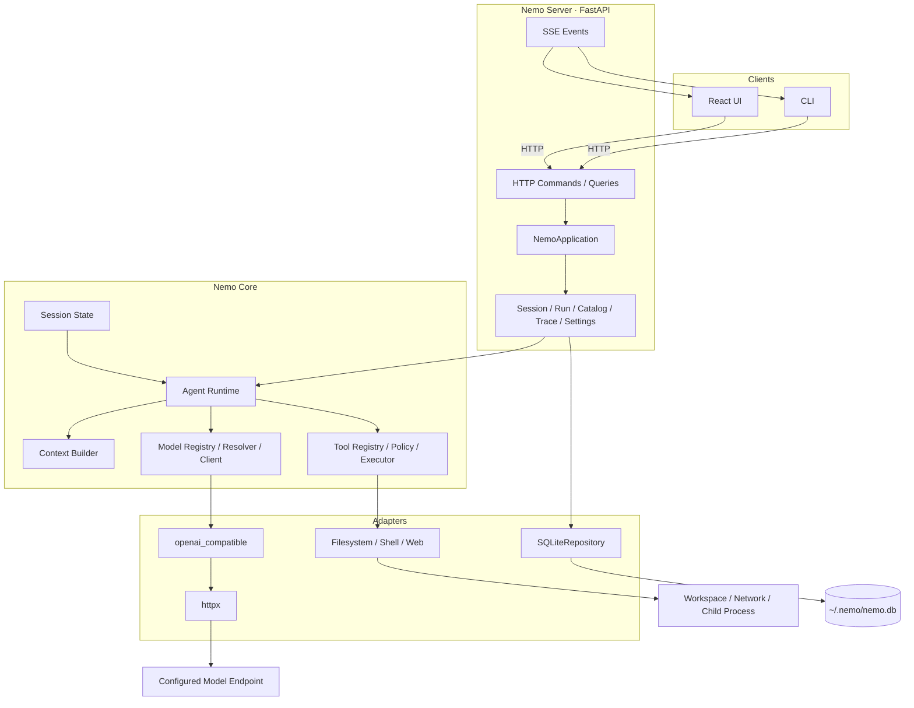
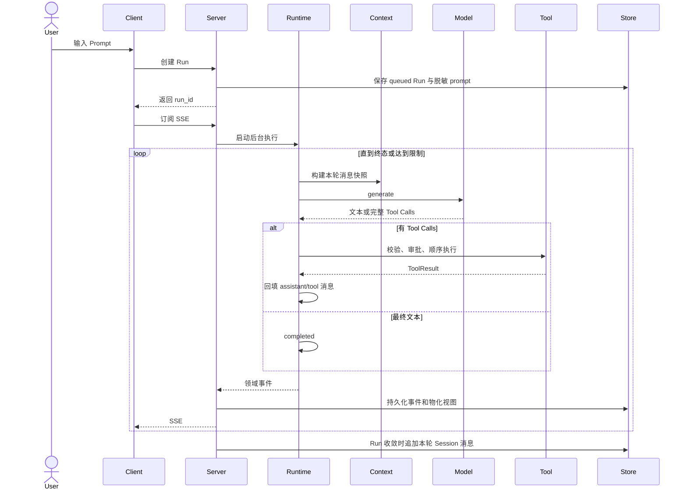
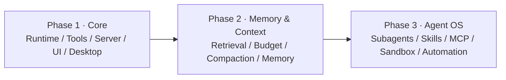

# Nemo 架构

> 当前状态：Phase 1 / M1–M6 已完成；桌面、Web、CLI 三个客户端都通过同一 Server 使用 Runtime。

Nemo 是可日常使用的个人 Agent，也是从底层研究 Agent Runtime、Context、Memory 和多 Agent 协作的实验平台。基础设施采用成熟库，Agent Loop 与核心智能机制自行实现。

## 1. 架构原则

- **Core 与客户端分离**：CLI、Web 和未来 Desktop 都通过同一 Server 使用 Runtime；Core 不知道 UI 的存在。
- **Providers are configuration, protocols are code**：Provider 是配置；协议差异封装在 adapter；Runtime 不出现厂商分支。
- **Session 与 Run 分离**：Session 保存跨轮状态；Run 表示一次用户输入触发的独立执行。
- **命令与事件分离**：HTTP 提交命令，SSE 传输领域事件；Prompt 不是文件协议。
- **Memory 与 Context 分离**：Memory 保存可复用信息；Context 决定一次模型调用实际看到什么。
- **边界先于能力**：路径、输出、超时、取消、审批和脱敏必须可测试；不得把审批或 workspace 描述为沙箱。
- **单一 Runtime**：CLI、Server、UI、未来 Subagent 均复用同一 Agent Loop，不复制执行内核。

## 2. 当前系统

当前主路径是 `Client → Server → Runtime → Model/Tool → Event/Result`。CLI 的 `--direct` 模式保留旧的嵌入式调用与 JSONL transcript，只用于测试、恢复和调试。

## 3. 模块边界

| 层 | 位置 | 职责 | 不负责 |
|---|---|---|---|
| Contracts | `core/contracts/` | Pydantic 数据、Protocol、错误语义 | I/O、厂商装配 |
| Runtime | `core/runtime/` | Agent Loop、状态、步数、终态、取消 | HTTP、SQLite、终端交互 |
| Session | `core/session.py` | 会话标识、消息和 workspace 状态 | 文件或数据库 I/O |
| Context | `core/context/`、`prompts/` | 稳定系统前缀、历史、工具 schema、Reminder | 长期 Memory |
| Model | `core/models/` | Registry、Resolver、统一 Model Client | 厂商判断、密钥持久化 |
| Tool Core | `core/tools/` | 注册、参数校验、审批策略、路径与输出约束 | 具体文件或进程 I/O |
| Adapters | `adapters/` | 协议、HTTP、持久化、Filesystem、Shell、Web | Agent Loop |
| Application | `server/` | 应用外观及 Session、Run、Catalog、Trace、Settings 用例；HTTP/SSE | 第二套 Runtime |
| Clients | `cli/`、`apps/ui/`、`apps/ui/src-tauri/` | 用户输入、显示、交互式审批；UI 状态、视图组件与桌面窗口/sidecar 生命周期 | 直接访问数据库和密钥 |
| Bootstrap | `bootstrap.py` | 唯一的具体依赖装配入口 | 领域逻辑 |

依赖方向始终从外向内：客户端和 Server 可依赖 Core；Core 不反向依赖它们。

## 4. 执行模型

一次 Run 的核心流程：

关键语义：

- 一次 step 是一次模型调用及其产生的全部工具调用；`max_steps` 按模型调用计数。
- Tool Calls 先作为完整 assistant 消息写入，再按 `tool_call_id` 回填结果。
- 多个工具按响应顺序执行，保证文件与 Shell 副作用可预测。
- 未知工具、参数错误和预期执行失败以 ToolResult 回填，允许模型修正。
- 正常完成、失败、取消和步数耗尽是不同终态；每个 Run 只产生一个终态。
- 取消传播到模型请求和工具进程；Shell 超时或取消会清理整个进程组。
- 不自动重放有副作用的工具；Server 崩溃恢复后将活动 Run 标记为 `interrupted`。

## 5. Model、Context 与 Tool

### Model

配置对象分四层：Provider 描述端点与协议；Model 描述远端模型身份和能力；Alias 提供别名；Profile 在 Model 上叠加参数。选择优先级为 `run > session > agent > default`。

当前只实现 `openai_compatible` adapter。`openai_responses` 与 `anthropic_messages` 是受支持的配置字面量，但没有 adapter；配置后会明确失败，不会静默切换协议。

`openai_compatible` 模型调用可读取流式 Chat Completions。Runtime 将脱敏、合批后的正文与可选推理分别作为 `model.delta` 和 `model.reasoning_delta` 事件送往 Server；工具调用片段在 adapter 内组装为完整参数并校验后才进入执行循环。Server 将事件持久化并用 SSE 序号支持断线续读，完整助手消息在 Run 收敛时写入 Session。详细机制见 [模型流式回复设计](docs/design/model-streaming.md)。

Runtime 在流式增量结束后仍取得完整 `ModelResponse`，用它完成工具调用和会话持久化；不支持流式的测试模型可继续返回完整响应。配置格式和密钥规则见 [配置参考](docs/reference/configuration.md)。

### Context

每次模型调用都生成独立消息快照：

1. 会话内稳定的 system 前缀；
2. 用户级与项目级 `AGENTS.md` 快照；
3. Session 历史；
4. 本轮临时 Reminder。

Reminder 只添加到当前请求，不写入 Session，避免随历史累积或破坏稳定前缀。当前只读取 workspace 根部的项目说明；向仓库根逐层收集是待办 T1。

### Tool

当前工具：

| 类型 | 工具 | 主要边界 |
|---|---|---|
| 文件 | `read_file`、`write_file`、`edit_file`、`list_dir` | 真实路径必须位于 workspace；输出受限 |
| 进程 | `run_shell` | 独立进程、显式 cwd、超时、输出上限、进程组清理 |
| 网络 | `web_search`、`fetch_url` | 仅 HTTP/HTTPS、响应大小和重定向受限 |

`run_shell` 可以访问当前用户有权访问的系统资源，因此路径检查和审批都不能替代未来 Sandbox。

## 6. Server、数据与安全

Server 是 Session、Run、审批和持久化的唯一生命周期所有者。同一 Session 同时只允许一个活动 Run；SSE 断线不会取消执行，客户端可通过事件序号继续读取。

Provider Settings 通过 Server 校验候选配置，并以原子替换写入 `~/.nemo/config.toml` 与权限为 `0600` 的 `~/.nemo/.env`。环境变量是只读高优先级来源；保存后的配置用于新 Run，活动 Run 不热切换。

SQLite 保存 Sessions、Messages、Runs、Approvals、Events，以及 Step 和 Tool Call 的查询视图。Prompt 由 HTTP JSON 进入内存并立即写入脱敏后的 Run 记录；Run 收敛时，本轮消息再追加到 Session 历史。取消或流式失败时，历史可能包含已显示的部分回复。不会生成独立的 Prompt JSON 文件。完整接口见 [Server API](docs/reference/server-api.md)。

安全边界：

- 密钥只从进程环境或 `~/.nemo/.env` 解析，不进入 SQLite、事件或 API 响应。
- Provider API 只暴露安全元数据和密钥是否已配置；URL 的 userinfo、query 和 fragment 不返回。
- 日志、错误与事件使用安全摘要，不返回原始异常或请求 header。
- Server 只允许 loopback host。桌面 sidecar 额外要求每次启动生成的 `X-Nemo-Token` 并检查 Origin；浏览器开发模式与 CLI 继续依赖本机 loopback，不使用该令牌。
- 远程 Provider 会接收模型请求上下文；“本地运行”不代表数据不会离开本机。

## 7. 目标演进

- **Phase 1**：完成单 Agent 的可运行、可观察客户端闭环。
- **Phase 2**：将基础 Context Builder 演进为带预算、检索和压缩的 Context Engine，并加入分层 Memory。
- **Phase 3**：加入 Orchestrator、Subagents、Skills、MCP、Sandbox、Planning、Automation 和完整 Permission Engine。

Subagent 将复用同一个 Runtime，但拥有独立状态、上下文、工具集合和预算；MCP 工具通过 Tool Registry 接入；Memory 通过 Context Engine 选择后进入单次模型请求。

## 8. Roadmap

| Milestone | 状态 | 交付 |
|---|---|---|
| M1 · Agent Runtime | 已完成 | Contracts、状态机、Loop、Fake、事件与取消 |
| M2 · Model System | 进行中 | 配置、密钥、Resolver、Model Client；当前实现 `openai_compatible` |
| M3 · Local Execution | 已完成 | 文件、Shell、Web 工具与执行边界 |
| M4 · Context、CLI、Server | 已完成 | 稳定上下文、Session、审批、SQLite、HTTP/SSE |
| M5 · React UI | 已完成 | 查询 API、React UI、Provider Settings 与安全配置写入 |
| M6 · macOS App | 已完成 | Tauri、Python sidecar、共享历史与 Run 属主协调、访问保护和 `onedir` 打包 |

Phase 1 的完成标准是：用户从 Nemo.app 配置 Provider、选择模型、提交任务、审批工具、查看 Trace 并得到结果；CLI 可完成同等闭环。Phase 1 不包含长期 Memory、Skills、MCP、Subagents、Browser/Computer Use、操作系统 Sandbox 或 Automation。

实施记录见 [docs/milestones](docs/README.md#当前状态)，未进入里程碑的已决定事项见 [TODO](docs/TODO.md)。
