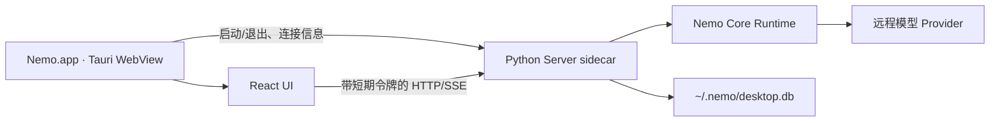

# macOS App 与 Python Sidecar

> 状态：M6 已完成（2026-09-23）；Server 字段与访问条件见 [Server API](../reference/server-api.md)，交付记录见 [M6](../milestones/M6-macos-app.md)。

## 目标与边界

Nemo.app 使用 Tauri 承载现有 React UI，Rust 只管理窗口、Python sidecar 与一次启动内的连接凭据。Agent Loop、模型、工具、配置和 SQLite 仍由现有 Python Server 负责；桌面端不再复制这些逻辑。浏览器开发模式与普通 CLI 继续连接原有的 `NEMO_SERVER_PORT`，不受桌面令牌约束。



## 启动与连接

1. Tauri 启动时生成一次性随机令牌，并通过子进程环境交给 Python sidecar；令牌不写入仓库、配置或数据库。
2. Python 读取后立即从进程环境移除令牌，在 `127.0.0.1:0` 绑定系统分配的空闲端口，通过 stdout 的 `NEMO_READY:<port>` 通知 Rust。
3. Rust 的 `desktop_connection` 命令只把端口、令牌和桌面默认工作目录交给应用窗口。React 在 Tauri 环境连接此端口；浏览器开发模式仍走 `/api` 代理。
4. 桌面端 SSE 使用带令牌的 `fetch` 流，按事件序号续读；浏览器模式保留原生 `EventSource`。

随机端口避免与手动启动的固定端口 Server 冲突。首版桌面 sidecar 使用 `~/.nemo/desktop.db`；普通 CLI Server 仍使用 `~/.nemo/nemo.db`。两者可并行，但会话历史暂不互通。这样避免一个 Server 启动时把另一个 Server 的活动 Run 误判为遗留任务。桌面 sidecar 不会接管或杀死用户手动启动的 Server；统一会话历史需要后续设计跨进程所有权或单实例协调。

打包应用的 sidecar 工作目录没有用户含义，因此新 Session 的默认 workspace 由桌面壳上报用户主目录；用户仍可在“Open a workspace”中改成任意存在的绝对路径。

## 本地访问保护

桌面模式下所有 HTTP 路径（包括 `/health`、OpenAPI 与 SSE）都要求 `X-Nemo-Token`；浏览器跨源请求仅接受打包应用 Origin 或本机 Vite 开发 Origin，预检请求只允许明确的方法与 header。Origin 检查是浏览器层的附加限制，真正的访问凭据是随机令牌；它不是操作系统沙箱，也不能阻止拥有当前用户完整权限的本地恶意程序。

令牌只存在于 Rust、Python 进程内存和已加载的应用窗口内。若 WebView 被注入恶意脚本，令牌仍可能暴露，因此继续使用受限的 Tauri capability、CSP 和不执行原始 HTML 的 Markdown 渲染。Provider API Key 不交给桌面壳，仍由 Python Server 按现有规则读取。

## 进程与打包

`build_sidecar.py` 在 Conda `nemo` 环境里用 PyInstaller 构建当前 Mac 架构的单文件 Server，再由 Tauri `externalBin` 放入 `.app`。用户打开打包应用时不需要预装 Python。Rust 在 App 退出时停止 sidecar；PyInstaller 的单文件启动器可能另有子进程，因此 Python 同时监测父进程，父进程消失时主动关闭 Server。若 App 意外退出，未完成的 Run 按现有启动恢复逻辑标记为 `interrupted`，不自动重放工具。

开发命令：

```bash
PATH="$HOME/.cargo/bin:$PATH" npm --prefix apps/ui run desktop:dev
PATH="$HOME/.cargo/bin:$PATH" npm --prefix apps/ui run desktop:build
```

生成的 sidecar 与 Rust `target/` 不入 Git；`Cargo.lock`、npm lock、配置和源图标入 Git。当前验证范围是 Apple Silicon macOS；Intel Mac 需在对应目标架构下重新构建。构建产物尚未签名或公证，不作为公开发布包。

## 验证与遗留

- Python：桌面访问拒绝无令牌、错误令牌与不允许的 Origin；普通 Server 不变。
- 前端：桌面 HTTP 与 SSE 均携带令牌，跨网络片段解析与终态处理正常；新 Session 使用桌面壳上报的默认工作目录。
- 打包：PyInstaller 二进制可启动，随机端口返回正确访问状态；Tauri `cargo check` 与 `.app` 构建通过。
- 待后续确认：应用签名/公证、Intel 架构产物、真实 Provider 端到端试用，以及安装包交付方式。
