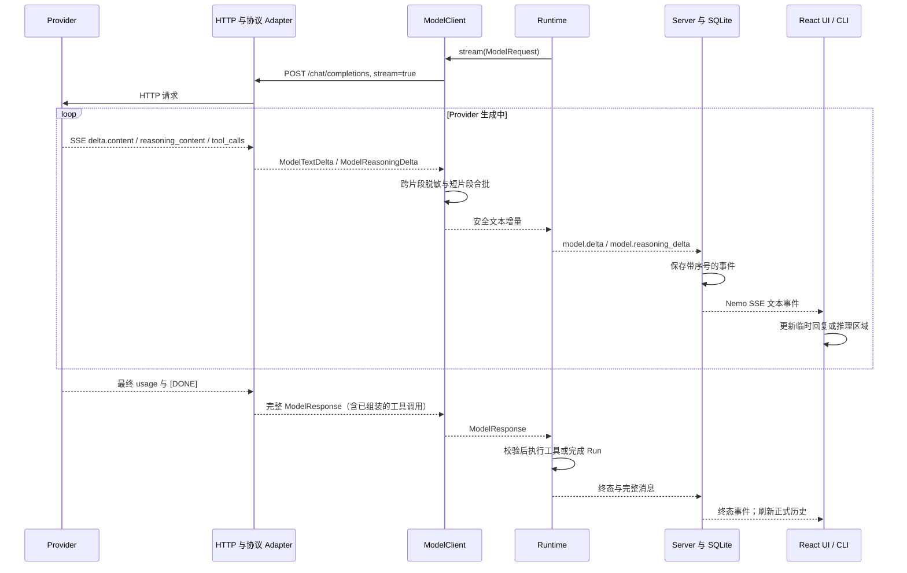

# 模型流式回复设计

> 状态：`openai_compatible` 已实现；接口字段见 [Server API](../reference/server-api.md#sse)。

## 1. 目标与边界

Nemo 使用模型服务实际返回的流式片段，让用户在模型尚未完成本次调用时看到正文。这里有两段独立的流：Provider 向 Nemo 返回 Chat Completions SSE；Nemo 再把 Runtime 事件通过自己的 SSE 发送给 React UI 或 CLI。第二段流由已持久化的事件支撑，可以断线续读，因此不是简单地转发 Provider 的原始字节。

正文与 Provider 提供的 `reasoning_content` 分成两路：前者使用 `model.delta`，后者使用 `model.reasoning_delta`，页面把推理放在可折叠区域。没有返回 `reasoning_content` 的模型不会显示该区域。未完成的工具参数和 Provider 原始响应均不作为文本事件发送。Runtime 仍需取得完整、已校验的 `ModelResponse`，才能决定本轮结束还是执行工具。

## 2. 数据流



`ModelTextDelta`、`ModelReasoningDelta` 与最终 `ModelResponse` 是不同的 Core 契约。增量只用于即时显示，完整响应决定 Agent Loop 的状态和工具执行。没有流式接口的测试模型仍可通过 `generate()` 返回完整响应。

## 3. Provider 解析与工具调用

`HttpxTransport` 逐行读取 Provider 的 HTTP 流；`OpenAICompatibleAdapter` 解析 `data:` 帧，忽略 keep-alive 等非数据行，并要求以 `data: [DONE]` 正常结束。正文来自 `choices[0].delta.content`，推理来自 `choices[0].delta.reasoning_content`；最后的用量字段存在时写入 `model.completed`。

工具调用可能分布在多个帧中。Adapter 按 `tool_calls[].index` 收集 ID、名称和 JSON 参数片段，等流结束后才解析和校验完整调用。中途断流或参数不完整会使模型调用失败，不会执行部分工具请求。Runtime 保持原有顺序：完整 assistant 消息先进入本轮上下文，然后依次审批、执行工具并回填结果。

## 4. 安全、合批与持久化

`ModelClient` 在发布正文和推理增量前分别做跨片段脱敏：暂存可能尚未结束的敏感值片段，再对完整片段运行现有的凭据脱敏规则。它按约 80 毫秒或 80 字符合批，减少每个 Provider 小片段都触发 SQLite 写入和前端重绘。合批意味着显示节奏取决于 Provider 返回速度与缓冲边界，不保证严格逐字符更新。模式脱敏是防误泄露措施，不是对任意秘密内容的形式化保证。

Runtime 给每个正文或推理增量分配 Run 内连续事件序号；Server 将事件写入 SQLite，并用同一序号作为 Nemo SSE 的 `id`。SSE 断开不取消 Run。客户端可用 `Last-Event-ID` 或 `?after=<seq>` 续读；页面刷新时，React 从 Trace 中已保存的增量重建临时回复和推理，再从最后序号继续订阅。Activity 面板不逐条展示这些高频文本事件。

## 5. 终态与客户端显示

React 在运行中显示临时助手消息，终态后用 Server 返回的 Session 历史替换，避免把草稿和正式消息各留一份。最终消息单独保存推理，刷新后仍可在对应助手消息中展开查看。`openai_compatible` 仅在同一用户轮次的后续工具调用请求中回传推理；进入下一轮用户输入时不再回传旧推理。CLI 收到正文增量后直接写入终端，不为每段额外换行，也不在结尾重复打印完整输出。

成功时，Runtime 使用完整 `ModelResponse` 写入助手消息；取消或流式失败时，已发布并显示的部分正文会作为本轮部分结果保留，Run 状态仍分别是 `cancelled` 或 `failed`。未经发布的缓冲片段不作为可见回复。Server 重启后仍不重放未完成 Run 或有副作用的工具。

## 6. 当前限制与验证

- 当前只实现 `openai_compatible` 的 Chat Completions 流；`openai_responses` 与 `anthropic_messages` 仍无适配器。
- 推理只在 Provider 返回 `reasoning_content` 时可见；工具参数只在完整校验后使用。推理是模型草稿，不应当作最终答复或已验证事实。
- Token 用量依赖 Provider 最终帧；未报告时保持未知，不伪造为零。
- 离线测试覆盖 SSE 片段、分段工具参数、断流、跨片段脱敏、取消/失败、Server 序号回放及 React 刷新恢复。真实 Provider 的流式行为需在显式连接验证时确认，因为外部请求可能计费。

验证命令：

```bash
conda run -n nemo python -m unittest discover -s tests -q
npm --prefix apps/ui test -- --run
npm --prefix apps/ui run typecheck
npm --prefix apps/ui run build
```
