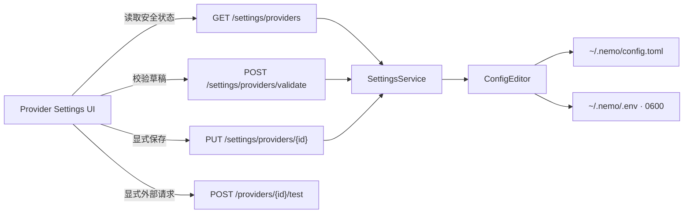

# Provider Settings 设计

> 状态：M5c 已实现。本文是配置写入、密钥处理与 UI 行为的权威设计。

## 1. 目标

用户无需手工编辑文件，即可在 Nemo UI 中新增或更新一个 Provider 及其 Model、选择默认模型、配置 API Key、配置可选 Proxy，并显式测试连接。

M5c 不做通用 TOML 编辑器。Alias、Profile、静态 headers 和模型 parameters 继续由高级用户手工维护；图形界面保存时必须原样保留这些现有配置。

## 2. 分层与接口

Server 返回 Provider、Model、变量名和密钥来源，但绝不返回密钥或 Proxy 值。校验与保存使用同一个请求模型；校验只在内存生成候选配置，保存才写文件。

一次请求编辑一个 Provider 和一个 Model：

- Provider：标识、协议、Base URL、API Key 变量名、Proxy 变量名、超时；
- Model：内部名称、远端 Model ID、Tool Calling 能力；
- Default：可选择把本次 Model 设为默认；
- API Key / Proxy：分别使用 `keep`、`replace`、`delete` 三态动作。

更新已有 Provider 时保留其 headers；更新已有 Model 时保留 parameters。其他 Provider、Model、Alias 和 Profile 不受影响。

## 3. 密钥与 Proxy

`api_key_env` 和 `proxy_env` 都只保存变量名。值的解析顺序统一为：

1. Nemo Server 进程环境；
2. `~/.nemo/.env`。

`proxy_env` 未配置时，HTTP transport 保持 `httpx` 默认的环境变量行为，继续支持 `HTTP_PROXY`、`HTTPS_PROXY`、`ALL_PROXY` 和 `NO_PROXY`。配置 `proxy_env` 后，Nemo 显式读取对应变量，并只把值交给该 Provider 的 HTTP client。

环境变量来源是只读覆盖层：UI 可以看到 `environment`，但保存操作不能覆盖或删除它。文件来源可以保持、替换或删除。API Key 和 Proxy 值不进入响应、日志、SQLite、错误或 Trace。

## 4. 写入与生效

- Server 先构造完整候选 `AppConfig` 并执行现有引用与保留参数校验；失败时不写文件。
- `config.toml` 由受控 serializer 规范化写出；`.env` 保留未涉及的行和变量。
- 两个文件分别通过同目录临时文件、`fsync` 和 `os.replace` 原子替换；`.env` 最终权限固定为 `0600`。
- 保存接口串行化，避免两个 UI 请求互相覆盖。
- 保存成功后，新 Session、目录查询、连接测试和新 Run 读取新配置；已经开始的 Run 保持创建时的 Model Client，不热切换。
- 保存不自动发起连接测试，避免隐式网络请求与费用。
- 删除 Provider 会级联移除其 Model 及对应 Alias/Profile；默认项受影响时切换到剩余 Model。最后一个可用 Model 不允许删除，`.env` 中的凭据默认保留。

## 5. UI

Settings 沿用 Nemo 三栏工作台，不新增独立后台风格：

- 右侧 Inspector 在 Run 与 Connections 两个视图间切换；Connections 在桌面端展开为宽抽屉，窄屏使用全宽布局；
- Connections 顶部以横向连接卡切换已有 Provider，并提供独立的 `Add provider` / `Custom` 入口；
- 编辑区明确区分 Provider 与 Model 各自的 `create` / `edit` 状态，按 Connection、Credentials、Model 和高级网络选项分组；新增 Provider 使用 `Confirm add`，不会被初始 Provider 自动选择覆盖；
- Model 区完整列出当前 Provider 的全部模型；`Add model` 进入独立空白编辑态，保存时追加模型而不覆盖同 Provider 的现有模型；
- 密钥字段只接受新值，不显示旧值；
- `Validate` 只检查配置，`Save changes` 才写文件，`Test connection` 在保存后由用户单独触发；
- 已有 Provider 在底部操作区、紧邻 `Save changes` 提供 `Delete provider`；删除需要二次确认，确认文案明确列出级联范围以及凭据保留行为；
- 错误明确指出字段或引用，成功状态明确区分“已校验”“已保存”“连接成功”。

颜色、字体、间距和焦点样式复用现有深海蓝绿视觉系统；状态来源是该面板唯一的强化视觉信息，不增加装饰性卡片或动画。

## 6. 验收标准

- 能新增 Provider + Model、更新现有项并设为默认，保存后无需重启 Server 即可出现在目录中。
- 校验失败、环境变量覆盖、无效 Proxy 变量名和文件写入失败均不会泄漏或部分提交敏感值。
- `.env` 权限为 `0600`，未知变量和注释得到保留；API 从不返回原值。
- `proxy_env` 可以从进程环境或 `.env` 解析并传给对应 Provider transport；未配置时现有标准 Proxy 行为不变。
- UI 完成读取、校验、保存、多模型追加和显式连接测试，键盘与窄屏布局可用。

## 7. 非目标

M5c 不提供任意 headers/parameters 编辑、Alias/Profile 管理、配置导入导出、多用户冲突合并、远程 Server 管理或活动 Run 热切换。Tauri 访问凭据与 Origin 防护已由 M6 完成，见 [macOS App](macos-app.md)。
