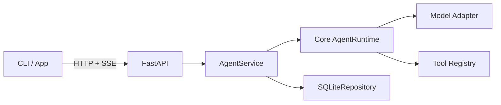

# Server 与持久化设计

> 状态：已实现（2026-09-21）。
> 对应范围：本地 Server、Sessions/Runs API、SSE、审批回传与 SQLite。

## 1. 目标

把 Session、Run、事件与审批变成本地 Server 拥有的唯一生命周期，供 CLI 与后续 Desktop/Web 客户端共用。Server 是 Core Runtime 的宿主，不改变 Core 的框架无关性。

## 2. 分层与接口

最小 API：

- `POST /sessions`、`GET /sessions`、`GET /sessions/{session_id}`、`PATCH /sessions/{session_id}`
- `POST /sessions/{session_id}/runs`、`GET /runs/{run_id}`
- `POST /runs/{run_id}/cancel`
- `GET /runs/{run_id}/events`（SSE，支持 `Last-Event-ID`）
- `POST /runs/{run_id}/approvals/{request_id}`

## 3. 决策与理由

| 决策 | 理由 |
|---|---|
| Server 只监听 `127.0.0.1` | M4c 是本地单用户进程，不提前引入远程认证 |
| 每个 Session 最多一个活动 Run | 同一对话中并发追加消息没有可定义的顺序 |
| SQLite 事件序号是对外顺序 | 审批事件产生在 Runtime 之外，持久化层统一排序才能断线续传 |
| SSE 断开不取消 Run | 客户端应能重连；取消必须走显式端点 |
| 审批等待超时后拒绝 | 无人回答时 fail closed，不把断线当成授权 |
| 重启后活动 Run 标记 `interrupted` | 不自动重放可能有副作用的工具 |
| 密钥不入 SQLite | 密钥仍由 `SecretLoader` 在运行时解析 |

## 4. 验收标准

- 能通过 HTTP 创建 Session 和 Run，并查询终态。
- SSE 按序号输出事件，重连不重复旧事件。
- 取消传播到 Runtime 和工具子进程。
- `ask`/`auto` 需要审批时产生可回传的持久化请求。
- Server 重启后不重放未完成 Run。
- Session 历史由 SQLite 恢复，不依赖 CLI JSONL。
- 密钥不出现在 API、SSE 或 SQLite。

## 5. 非目标

- 远程多用户部署、TLS、账号与租户隔离。
- Server 崩溃后自动续跑一个 Run。
- token 级模型流式输出；M4c 先流式传输已有的领域事件。
- 通过 API 写入密钥或修改 Provider 配置。
