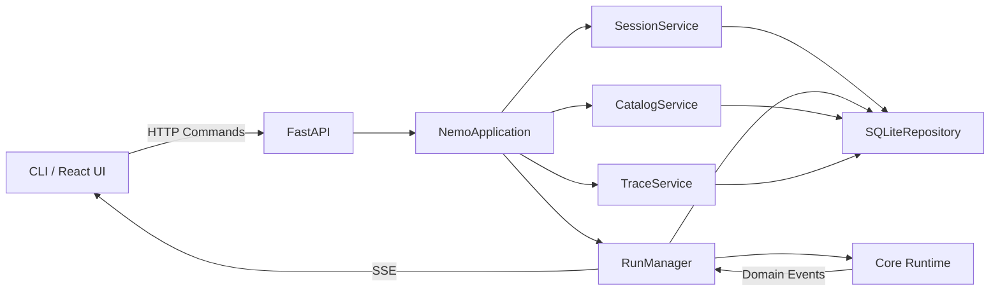

# Server 与持久化设计

> 状态：M4c 已实现；现行接口见 [Server API](../reference/server-api.md)。

## 1. 目标与边界

Server 让 CLI、React UI 和未来 Desktop 共享一个长期运行的 Agent 后端。它拥有 Session、Run、审批、事件和 SQLite 生命周期，但只编排现有 Core Runtime。

Server 不实现第二套 Loop，不让客户端直接访问 SQLite，也不把 Prompt 或上层命令保存为临时 JSON 文件。

## 2. 分层

- FastAPI 负责传输、schema 和状态码。
- `NemoApplication` 是供 HTTP 层调用的薄外观，不保存第二份业务逻辑。
- `SessionService`、`CatalogService` 和 `TraceService` 分别负责会话、模型/Provider 目录和 Trace 查询。
- `RunManager` 负责活动 task、取消、审批等待、Runtime 装配和事件持久化。
- Runtime 负责执行语义。
- `adapters/persistence/` 中的 Repository 负责事务和查询；schema 与事件投影独立，不向 Core 泄漏 SQLite。

## 3. 生命周期

1. 创建 Session 时解析 workspace、模型和审批模式，并快照说明文件。
2. 创建 Run 时保存 queued Run 和脱敏 Prompt。
3. 后台 task 装配 Runtime，并把事件写入 SQLite 和 SSE。
4. 需要审批时 Runtime 等待客户端通过专用接口回答。
5. 正常收敛时在一个事务中写入终态并追加本轮 Session 消息；SSE 发完剩余事件后关闭。

同一 Session 只允许一个活动 Run。SSE 断线不取消执行；客户端按事件序号续读。Server 启动时把遗留活动 Run 标记为 `interrupted`，不重放可能有副作用的工具。

## 4. 数据

SQLite 持久化：

- Session 元数据和设置；
- 对话 Messages；
- Run 状态、结果、安全错误和实际模型身份；
- 审批请求与回答；
- 有连续序号的领域 Events；
- Step 与 Tool Call 的查询数据。

Trace 由持久化事件和物化数据组装。Token 不可用时保持 `null`，不伪造为 0。密钥、请求 header 和 Provider 原始响应不入库。

## 5. 关键决策

| 决策 | 理由 |
|---|---|
| 本地 HTTP/SSE 而非进程内专用接口 | CLI、Web、Desktop 可复用，边界可测试 |
| 领域事件作为 SSE 数据 | 客户端与 Runtime 事件语义一致 |
| SQLite 序号兼作重连游标 | 不维护第二套内存 offset |
| Prompt 先进入 Run，收敛后再物化 Messages | 创建请求可追溯，同时不制造临时文件协议 |
| 不自动恢复活动 Run | 避免重复执行文件和 Shell 副作用 |

## 6. 验收标准

- Session/Run 创建、查询、取消、审批和事件续读可通过 HTTP 完成。
- 同一 Session 的并发 Run 返回冲突。
- 重启后历史可查询，遗留活动 Run 变为 `interrupted`。
- API、SQLite、事件和 Trace 不包含密钥。
- Core 不依赖 FastAPI 或 SQLite。

## 7. 后续

M5c 增加安全配置写入；M6 增加 Tauri sidecar、短期访问凭据、Origin 检查和进程收敛。远程访问、多用户和分布式队列不在当前范围。
