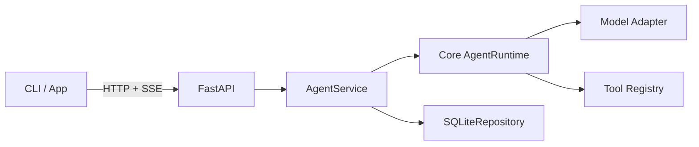
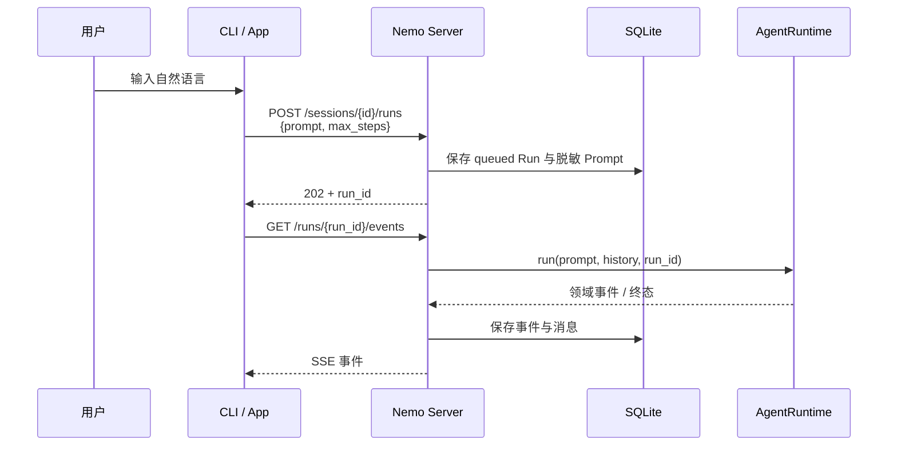

# Server 与持久化设计

> 状态：已实现（2026-09-21）。
> 对应范围：本地 Server、Sessions/Runs API、SSE、审批回传与 SQLite。

## 1. 目标

把 Session、Run、事件与审批变成本地 Server 拥有的唯一生命周期，供 CLI 与后续 Desktop/Web 客户端共用。Server 是 Core Runtime 的宿主，不改变 Core 的框架无关性。

## 2. 分层与接口



### 2.1 HTTP API

| 方法 | 路径 | 请求体 | 成功响应 | 作用 |
|---|---|---|---|---|
| `GET` | `/health` | 无 | `200 {"status":"ok"}` | 健康检查 |
| `POST` | `/sessions` | `workspace`、可选 `model`、`approval_mode` | `201 SessionResponse` | 创建 Session，并快照用户级/项目级指令 |
| `GET` | `/sessions` | 无 | `200 SessionResponse[]` | 按最近更新时间列出 Session |
| `GET` | `/sessions/{session_id}` | 无 | `200 SessionResponse` | 查询 Session 与历史消息数 |
| `PATCH` | `/sessions/{session_id}` | 可选 `model`、`approval_mode` | `200 SessionResponse` | 修改后续 Run 使用的会话设置 |
| `PUT` | `/sessions/{session_id}/model` | `model` | `200 SessionResponse` | 校验并切换后续 Run 的模型选择 |
| `GET` | `/sessions/{session_id}/messages` | 无 | `200 Message[]` | 恢复脱敏后的会话历史 |
| `GET` | `/sessions/{session_id}/runs` | 无 | `200 RunResponse[]` | 列出该会话的 Run |
| `POST` | `/sessions/{session_id}/runs` | `prompt`、`max_steps` | `202 RunResponse` | 把一次用户输入创建为后台 Run；同一 Session 同时只能有一个活动 Run |
| `GET` | `/runs/{run_id}` | 无 | `200 RunResponse` | 查询 Run 状态、最终输出与安全错误摘要 |
| `GET` | `/runs/{run_id}/trace` | 无 | `200 TraceResponse` | 查询持久化事件及 Step、模型调用、工具调用耗时 |
| `POST` | `/runs/{run_id}/cancel` | 无 | `200 ActionResponse` | 请求取消活动 Run；已终止时返回 `already_terminal` |
| `POST` | `/runs/{run_id}/approvals/{request_id}` | `outcome` | `200 {"status":"answered"}` | 回传 `allow_once`、`allow_session` 或 `deny` |
| `GET` | `/runs/{run_id}/events` | 查询参数 `after`，或请求头 `Last-Event-ID` | `200 text/event-stream` | 按 SQLite 事件序号发送 SSE；重连时只发游标之后的事件 |
| `GET` | `/models` | 无 | `200 ModelOptionResponse[]` | 列出 profile、alias 与直接模型选择 |
| `GET` | `/providers` | 无 | `200 ProviderResponse[]` | 列出不含密钥/header 的 Provider 状态 |
| `POST` | `/providers/{provider_id}/test` | 可选 `model` | `200 ProviderTestResponse` | 显式发起最小真实模型请求并报告延迟 |

`SessionResponse` 包含 `session_id`、`workspace`、`model`、`approval_mode`、创建/更新时间与 `message_count`。`RunResponse` 还包含实际解析出的 `model_selection`、`model_name`、`model_id`、`model_protocol` 与 `model_provider`；旧 Run 的这些字段可以为空。请求模型均拒绝未知字段，路径不存在返回 `404`，会话已有活动 Run 或审批已失效返回 `409`，请求体不合法返回 `422`。

FastAPI 同时提供 `/docs`、`/redoc` 与 `/openapi.json`，它们从实际请求/响应模型自动生成，作为实现契约的可执行视图。

### 2.2 Prompt 的传递与持久化

Prompt 不是一个落盘的 JSON 文件。CLI/App 在内存中把用户文本编码成 HTTP JSON 请求体：

```json
{
  "prompt": "读取 README.md，然后总结项目",
  "max_steps": 10
}
```

Server 将请求体解析成 `CreateRunRequest`，随后把 Prompt 写入 SQLite 的 `runs.prompt`，并把它与该 Session 已有的 `messages` 一起交给 `AgentRuntime`。Run 完成后，本轮用户消息和模型/工具消息会进入 `messages` 表，供下一轮恢复上下文。持久化边界会做最佳努力脱敏，但 Prompt 本身不应承载密钥。



### 2.3 上层命令与自然语言的边界

Server 不解析 `:help`、`:exit` 这类客户端命令，也不会从自然语言里用正则提取文件或 shell 命令。命令分流由上层客户端完成：

| 输入或动作 | 处理位置 | Server 交互 |
|---|---|---|
| `:help` | CLI 本地 | 无 |
| `:exit` / `:quit` | CLI 本地 | 无 |
| `:mode ask\|auto\|full` | CLI 解析 | `PATCH /sessions/{session_id}` |
| 普通自然语言 | CLI/App | `POST /sessions/{session_id}/runs`，原文放入 `prompt` |
| Ctrl-C / 停止按钮 | CLI/App | `POST /runs/{run_id}/cancel` |
| 审批按钮或终端回答 | CLI/App | `POST /runs/{run_id}/approvals/{request_id}` |

自然语言进入 Runtime 后，由模型产生带 `name` 和 `arguments` 的结构化 Tool Call；`ToolRegistry` 再按工具名校验、审批和分发。也就是说，客户端区分 UI 命令与 Prompt，模型区分聊天意图与工具调用，Server 负责生命周期与协议，不实现第二套自然语言命令解析器。

## 3. 决策与理由

| 决策 | 理由 |
|---|---|
| Server 只监听 `127.0.0.1` | M4c 是本地单用户进程，不提前引入远程认证 |
| 每个 Session 最多一个活动 Run | 同一对话中并发追加消息没有可定义的顺序 |
| SQLite 事件序号是对外顺序 | 审批事件产生在 Runtime 之外，持久化层统一排序才能断线续传 |
| SSE 断开不取消 Run | 客户端应能重连；取消必须走显式端点 |
| 审批等待超时后拒绝 | 无人回答时 fail closed，不把断线当成授权 |
| 重启后活动 Run 标记 `interrupted` | 不自动重放可能有副作用的工具 |
| 密钥不入 SQLite | 密钥仍由 `SecretLoader` 在运行时解析 |

## 4. 验收标准

- 能通过 HTTP 创建 Session 和 Run，并查询终态。
- SSE 按序号输出事件，重连不重复旧事件。
- 取消传播到 Runtime 和工具子进程。
- `ask`/`auto` 需要审批时产生可回传的持久化请求。
- Server 重启后不重放未完成 Run。
- Session 历史由 SQLite 恢复，不依赖 CLI JSONL。
- 密钥不出现在 API、SSE 或 SQLite。

## 5. 非目标

- 远程多用户部署、TLS、账号与租户隔离。
- Server 崩溃后自动续跑一个 Run。
- token 级模型流式输出；M4c 先流式传输已有的领域事件。
- 通过 API 写入密钥或修改 Provider 配置。
