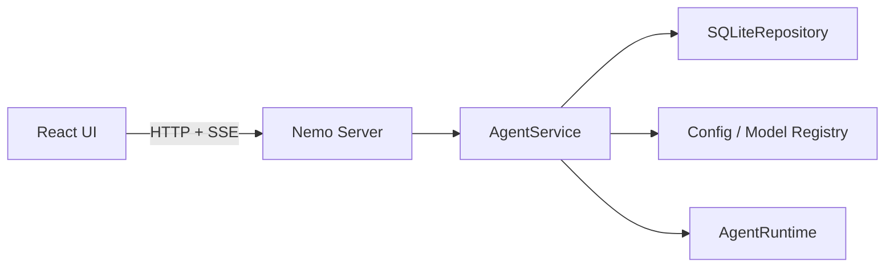

# React UI 与补充 API 设计

> 状态：M5a、M5b 已实现；M5c 待实施。

## 1. 目标

在不复制 Agent Runtime 的前提下，让 React UI 能恢复会话、查看 Run 与 Trace、切换模型、观察 Provider 配置状态，并复用 M4c 的创建 Run、SSE、取消和审批协议。

M5a 先补齐 UI 所需的只读与会话设置 API；M5b 创建 React UI；M5c 再处理 Provider 配置与密钥写入的完整交互。连接测试 API 已在 M5a 实现，但 M5b 只展示 Provider 状态，不会自动产生真实模型请求。

## 2. 分层与接口



M5a 新增：

| 方法 | 路径 | 用途 |
|---|---|---|
| `GET` | `/sessions/{session_id}/messages` | 恢复脱敏后的会话消息 |
| `GET` | `/sessions/{session_id}/runs` | 列出该会话的 Run |
| `PUT` | `/sessions/{session_id}/model` | 修改后续 Run 的模型选择 |
| `GET` | `/runs/{run_id}/trace` | 返回 Run、事件、Step、模型调用与工具调用耗时 |
| `GET` | `/models` | 返回 profile、alias、model 的可选项与默认项 |
| `GET` | `/providers` | 返回不含密钥的 Provider 元数据和密钥是否已配置 |
| `POST` | `/providers/{provider_id}/test` | 用指定或默认模型发送最小真实请求，返回安全结果与延迟 |

M4c 已有的 `/sessions`、`/runs`、`/events`、`/cancel` 与 `/approvals` 保持不变。

### 2.1 M5b 页面结构

```text
┌──────────────┬───────────────────────────────┬──────────────────┐
│ Sessions     │ Conversation                  │ Run / Trace      │
│ 新建/历史    │ 消息、输入、停止、审批卡片    │ 事件、工具、耗时 │
├──────────────┴───────────────────────────────┴──────────────────┤
│ Server 状态 · Workspace · Model · Approval Mode                │
└─────────────────────────────────────────────────────────────────┘
```

第一版只保留一个页面和一个活动 Session：左栏负责会话选择，中栏负责消息与任务控制，右栏展示当前/最近 Run 的事件和 Trace，底栏展示并修改会话级设置。Provider 摘要作为右栏设置卡片，不在 M5b 写配置。

开发态 API 基址固定为相对路径 `/api`，Vite 将它代理到 `http://127.0.0.1:8765` 并移除前缀；前端因此不需要放宽 Server CORS。生产打包与 sidecar Origin/短期凭据留到 M6。

## 3. 决策与理由

| 决策 | 理由 |
|---|---|
| UI 不读 SQLite | Schema 是 Server 内部实现，客户端只依赖稳定 API |
| 消息 API 返回脱敏历史 | SQLite 本来就是脱敏副本，API 不重新制造原始密钥通路 |
| 模型目录合并 profile、alias、model | UI 应展示用户能选择的名字，而不是只展示底层模型表 |
| Provider API 不返回 headers 或密钥值 | 静态 header 也可能承载凭据；UI 只需要配置状态 |
| 连接测试必须由用户显式触发 | 它会产生一次真实模型请求，不能在页面加载时自动调用 |
| Run 记录实际解析出的模型身份 | Session 选择可能是 profile/alias，Trace 必须说明最后用了什么 |
| Trace 从持久化事件和物化表生成 | 不复制第二套 tracing 状态，也不要求 Run 仍在内存 |
| 耗时由 UTC 时间戳计算 | 当前数据已经足够，M5a 不为派生值增加新列 |
| 暂不开放配置写入 | 修改 `config.toml`、`.env` 与密钥需要独立安全设计和原子写入策略 |

## 4. 验收标准

- 新建并完成 Run 后，消息、Run 列表与 Trace 可通过 HTTP 恢复。
- Trace 能显示实际模型身份、Run 总耗时、每个 Step/模型调用/工具调用耗时。
- 模型目录正确反映默认项、profile、alias 与直接模型名的解析结果。
- Provider 列表不含密钥和 header 值，只报告 `secret_configured`。
- Provider 连接测试不回显请求、响应正文或密钥，只返回模型身份和延迟。
- `PUT /sessions/{id}/model` 只影响后续 Run，并拒绝未知选择。
- 所有新增接口具有离线自动化测试，存量 CLI/Server 测试继续通过。

## 5. 非目标

- 本步不创建 React/Vite 目录；它属于 M5b，届时先更新根 `AGENTS.md`。
- 不通过 API 写入配置或密钥。
- 不实现 token 增量流式；UI 第一版先消费领域事件 SSE。
- 不实现远程访问认证、账号或多租户。
