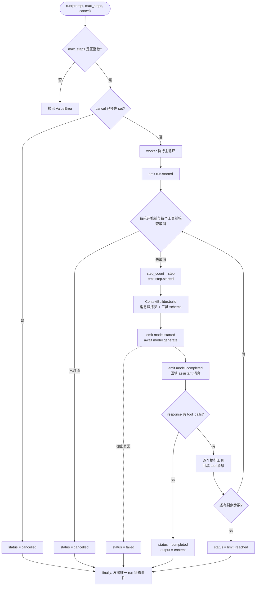

# M1 · Agent Runtime 最小闭环

| 项 | 内容 |
|---|---|
| 编号 | M1 |
| 状态 | 已完成 |
| 完成日期 | 2026-09-16（2026-09-17 完成环境清理） |
| 对应阶段 | Phase 1 · Core |
| 代码范围 | `src/nemo/core/`、`src/nemo/testing/`、`examples/`、`tests/` |

## 1. 目标与范围

**目标**：在没有真实模型、没有 Shell、没有 Server 与 UI 的前提下，把 Agent 的执行骨架跑通，并让每个边界行为都能被自动化测试锁定。

先做骨架而不是先接模型，原因是执行循环、状态生命周期、取消与事件语义是整个系统的地基。这些语义一旦定错，后面接真实模型、加 Memory、加多 Agent 都要返工；而模型接入是配置问题，可以后补。

**做**：

- 契约层：Pydantic 数据模型 + Provider 无关的 `Model` / `Tool` Protocol。
- Context Builder：为每次模型调用生成独立的输入快照。
- Tool Registry：工具注册、JSON Schema 导出、严格参数校验、错误归一。
- Agent Runtime：顺序执行循环、状态生命周期、步数上限、取消、事件流。
- Fake Model/Tool：无网络的确定性替身，用于测试与演示。
- 13 个 unittest 覆盖 M1 验收标准。

**不做**（刻意排除）：

- 真实模型接入、API Key、网络请求 —— 属于「Providers are configuration」阶段，先保证 Runtime 与厂商无关。
- Shell / Python 工具与真实文件系统副作用 —— 需要权限与隔离设计，不能顺手加。
- FastAPI Server、SSE、CLI、Tauri/React UI、持久化 —— 客户端不属于 Core，放后续里程碑。
- 工具自动重试、超时、流式 token、进程隔离、断点恢复 —— Phase 1 优先正确与可观测。

## 2. 交付物

| 文件 | 作用 |
|---|---|
| `src/nemo/core/contracts/types.py` | 全局契约：消息、工具调用与结果、模型请求/响应、`Model` Protocol、运行状态、事件与结果 |
| `src/nemo/core/context/builder.py` | 组装每次模型调用的请求，深拷贝消息历史，从注册表现算工具 schema |
| `src/nemo/core/tools/registry.py` | `Tool` Protocol、工具注册与查重、参数校验、三类错误的归一 |
| `src/nemo/core/runtime/agent.py` | 主循环、事件发射、状态转移、取消处理、终态保证 |
| `src/nemo/testing/fakes.py` | `AddTool`、脚本化 `FakeModel`（含请求捕获）、演示用 `AdditionModel` |
| `examples/minimal_agent.py` | 14 行闭环演示，未来 CLI 的雏形 |
| `tests/test_runtime.py` | 13 个验收用例 |
| `pyproject.toml` / `environment.yml` / `requirements-lock.txt` | 工程与依赖声明，唯一第三方依赖是 pydantic |
| `AGENTS.md` / `NEMO_ARCHITECTURE.md` / `README.md` | 协作规范、架构基线、使用说明 |

## 3. 关键决策与理由

| 决策 | 理由 | 放弃的替代方案 |
|---|---|---|
| 契约继承 `Contract` 基类，`extra="forbid"` + `frozen=True` | 字段名拼错、多传字段立即报错而非被静默忽略；契约对象构造后不可改，避免运行中被悄悄改写 | dataclass + 手写校验：校验容易漏，且与 JSON Schema 生成脱节 |
| 模型用 `Protocol` 而非抽象基类 | 任何有 `async generate(request)` 的对象都能接入，符合「Providers are configuration, protocols are code」；接入真实模型不必改 Runtime | 定义抽象基类：会迫使每个 provider 继承，厂商判断容易渗进 Core |
| 工具失败归一为 `ToolResult.error`，不向上抛异常 | 用错工具是 Agent 循环的正常输入，模型需要看到失败原因并决定下一步 | 抛异常中断 run：把可恢复场景变成致命错误 |
| 参数校验用 `strict=True` | 不做隐式类型转换，`{"a": "12"}` 判为参数错误，问题在边界暴露 | 宽松模式：类型错误被「帮忙转换」后当成功，问题推迟到更难定位的地方 |
| 在工具边界做可序列化性检查（`model_dump_json()`） | 不可序列化的返回值当场拒绝，不等写日志或发给客户端时才炸 | 只在真正序列化时才发现问题 |
| 事件与错误信息不含工具参数与原始异常文本 | 参数可能含密钥，异常文本可能含内部细节；测试用 `assertNotIn("secret must not appear", ...)` 锁定 | 完整记录便于调试，但违反密钥不入日志的规则 |
| `on_event` 回调异常只追加 `observer.failed`，不改变执行结果 | 观测与业务解耦：trace 系统故障不应该让任务失败 | 让观测异常终止任务：调试能力反过来影响正确性 |
| 取消保留两套语义：`cancel` Event 触发返回 `cancelled` 结果；外部 `task.cancel()` 清理后继续抛 `CancelledError` | 前者是业务取消，调用方需要拿到结果；后者必须遵守 asyncio 约定，否则调用方的 `await` 会误判任务正常结束 | 统一成一种语义：要么破坏 asyncio 惯例，要么让业务取消无法拿到 trace |
| 工具顺序执行、不自动重试 | Phase 1 优先正确与可观测，重试策略与并发属于后续里程碑 | 并发执行 + 自动重试：引入额外状态复杂度，当前无法验证收益 |
| `AgentState` 可变，其余契约不可变 | 状态本来就要在运行中更新，契约只负责传递 | 全部不可变：每次状态变化都要重建对象，收益不抵成本 |
| 每个 Run 独立状态、事件 `seq` 连续、终态事件唯一 | 并发 run 不串状态；客户端可稳定渲染；测试可断言 | 共享状态 + 全局事件流：并发下难以推理 |
| 开发环境统一 Conda（原用 uv） | 见 §4 第 7 步 | 继续用 uv：能力上等价，但与环境管理习惯不一致 |

## 4. 实施过程

1. **架构基线**：依据架构讨论整理 `NEMO_ARCHITECTURE.md`（6 张 Mermaid 图：总体演进、Phase 1 模块、模型接入、Agent Loop 状态机、任务时序、本地部署）。先建立 `AGENTS.md` 工作空间规范再动代码。
2. **工程骨架**：采用 src 布局，`pyproject.toml` 声明唯一第三方依赖 pydantic，目录用途与命名写进 `AGENTS.md`。
3. **契约层**：先定 `contracts/types.py`。契约先行是因为后续所有模块都要对着它写，改契约的代价远高于改实现。
4. **工具与上下文**：`tools/registry.py` 定为「校验 + 执行边界」，`context/builder.py` 定为「请求快照」，都不触碰循环。
5. **主循环**：实现 `runtime/agent.py`，把顺序执行、步数上限、取消与终态事件一次做全。循环里显式 `await asyncio.sleep(0)`，因为假实现同步返回、没有让出点时，取消信号无法被投递。
6. **测试与演示**：先写 `testing/fakes.py` 提供确定性替身，再写 13 个用例，最后加 `examples/minimal_agent.py` 做人工可读的闭环验证。
7. **环境方案调整（转折点）**：最初使用 uv（`.venv/` + `uv.lock`）。确认两者都能满足当前需求、差异主要在「Conda 还能管理非 Python 二进制依赖」后，按用户偏好统一到 Conda：新增 `environment.yml` 与 `requirements-lock.txt`，环境名 `nemo`，Python 依赖经环境内 pip 安装。创建环境时触发过默认 Anaconda 源的服务条款提示，处理方式是改用 `--override-channels -c conda-forge` 并关闭默认源，**没有接受条款、也没有修改全局 conda 配置**。uv 残留文件当时先标记停用，因为删除须经用户批准。
8. **清理（2026-09-17）**：经用户批准，`.venv/` 与 `uv.lock` 移出仓库（`rm -rf` 被环境保护拦截，改用移动到系统废纸篓，可恢复），`AGENTS.md` 与 `README.md` 的表述同步为「已清理」。

## 5. 验证证据

以下内容均来自实际执行，不是设计描述。

**闭环执行序列**：



演示 `12 + 30` 的实际事件流（共 12 条）：

```text
1  run.started      status: queued → running
2  step.started     step=1
3  model.started
4  model.completed  tool_call_count=1
5  tool.started     add
6  tool.completed   add → 42
7  step.completed   step=1
8  step.started     step=2
9  model.started
10 model.completed  tool_call_count=0
11 step.completed   step=2
12 run.completed    output="12 + 30 = 42"
```

对应消息列表的变化：

```text
[user] → [user, assistant(tool_calls=[add])] → [user, assistant, tool(result=42)] → [user, assistant, tool, assistant("12 + 30 = 42")]
```

**执行命令与结果**（环境 `nemo`，Python 3.12.14，pydantic 2.13.5）：

```bash
conda run -n nemo python -m unittest discover -s tests -v
```

```text
test_cancel_before_start ... ok
test_cancel_inflight_model_and_tool ... ok
test_complete_loop ... ok
test_concurrent_runs_are_isolated ... ok
test_contract_guards ... ok
test_external_task_cancellation_propagates ... ok
test_invalid_limits ... ok
test_max_steps ... ok
test_model_error ... ok
test_multiple_calls_keep_order ... ok
test_observer_failure_is_visible_and_does_not_break_execution ... ok
test_recoverable_tool_errors ... ok
test_schema_and_result_reach_next_model_call ... ok

Ran 13 tests in 0.025s

OK
```

```bash
conda run -n nemo python examples/minimal_agent.py && conda run -n nemo python -m pip check
```

```text
1 run.started ... 12 run.completed
completed 12 + 30 = 42
No broken requirements found.
```

**覆盖情况**：

| 验收点 | 对应验证 |
|---|---|
| 消息回填顺序正确 | `test_complete_loop`（`["user", "assistant", "tool", "assistant"]`） |
| 工具 schema 与结果确实传给下一轮模型 | `test_schema_and_result_reach_next_model_call` |
| 未知工具 / 参数错误 / 执行失败可恢复且不泄漏异常文本 | `test_recoverable_tool_errors` |
| 一次多工具调用保持顺序 | `test_multiple_calls_keep_order` |
| 步数上限生效 | `test_max_steps`（上限触发后不再调用模型） |
| 模型自身报错进入失败终态 | `test_model_error` |
| 取消前不启动循环 | `test_cancel_before_start` |
| 取消时正在执行的模型/工具被清理 | `test_cancel_inflight_model_and_tool` |
| 外部 `task.cancel()` 语义不被破坏 | `test_external_task_cancellation_propagates` |
| 观察者异常不影响执行 | `test_observer_failure_is_visible_and_does_not_break_execution` |
| 并发 run 状态隔离 | `test_concurrent_runs_are_isolated` |
| 非法步数上限被拒 | `test_invalid_limits`（`0`、`-1`、`True`、`1.5`） |
| 重名工具、重复调用 id、悬空 tool 消息被拒 | `test_contract_guards` |
| 终态事件唯一、`seq` 连续 | 全部用例共用 `assert_terminal` |

## 6. 遗留与下一步

**已知边界**：

- 不自动重试工具；错误以 `ToolResult` 形式回填给模型，由模型决定下一步。
- 无超时、无模型重试、无流式 token、无持久化、无断点恢复。
- 无进程隔离与沙箱；Phase 1 的执行边界不等同于安全边界。
- 取消保证依赖工具协作响应 asyncio 取消；CPU 阻塞或吞掉取消的实现不在保证范围内。
- 6 个 `__init__.py` 均为空，尚无稳定公开 API 出口，导入需写完整路径。
- `README` 中的环境创建命令为 `conda create --file environment.yml --override-channels -c conda-forge`，是绕开默认源服务条款提示后的写法，不等同于官方推荐的 `conda env create`。

**下一步**：

- 模型接入：Model Client、Provider Registry、Protocol Adapter（OpenAI Responses / OpenAI-compatible / Anthropic Messages），配置驱动，不改 Runtime。
- 工具扩展：Filesystem / Shell / Python，同时引入权限与超时设计。
- 客户端：Server（FastAPI + SSE）→ CLI → Desktop UI，Trace 面板消费现有事件流。
- 上述内容在架构文档中标为 Phase 1 后续，不在 M1 范围内。
